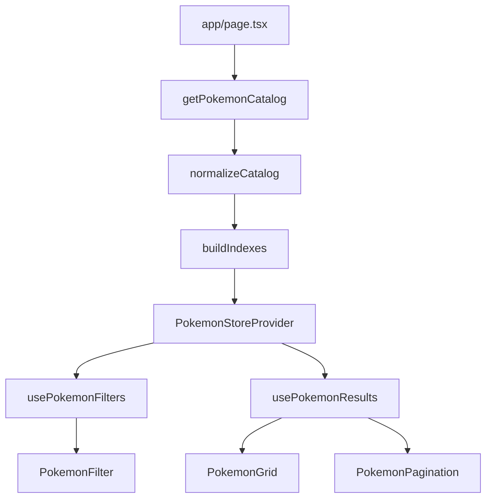

# Scalable Pokemon Data Architecture

## Goal

Refactor the current list-page flow so the app fetches the Pokemon catalog once, normalizes it into a canonical store, builds reusable indexes for filter dimensions, and exposes memoized selectors through Context + custom hooks.

Current leverage points:

- `[app/page.tsx](app/page.tsx)` already does the top-level list bootstrap.
- `[components/context/filter-context.tsx](components/context/filter-context.tsx)` already proves Context-based filter state is acceptable.
- `[components/ui/project-dashboard.tsx](components/ui/project-dashboard.tsx)` contains the orchestration that should be extracted into store/reducer/selectors.
- `[components/utils/filter-utils.ts](components/utils/filter-utils.ts)` shows the current filtering contract, but it is inaccurate because it filters against partially hydrated entities.

```7:22:app/page.tsx
export default async function Page() {
  const allPokemon = await getPokemonList();

  const initialResults = await Promise.all(
    allPokemon.slice(0, 8).map(fetchPokemonLight),
  );
  // ...
}
```

```24:28:components/utils/filter-utils.ts
return allPokemon.filter((pokemon) => {
  if (!pokemon.name.toLowerCase().includes(query)) return false;

  const details = detailsMap.get(pokemon.name);
  if (!details) return true;
```

## Recommended Folder Structure

Create a dedicated feature data layer and keep `app/` and `components/ui/` thin:

```text
app/
  layout.tsx
  page.tsx
  pokemon/[id]/page.tsx
components/
  providers/
    pokemon-store-provider.tsx
  ui/
    pokemon-items/
      pokemon-grid.tsx
      pokemon-filter.tsx
      pokemon-pagination.tsx
    pokemon-by-id/
      ...
lib/
  pokemon/
    api/
      client.ts
      catalog.ts
      detail.ts
    model/
      types.ts
      normalize.ts
      indexes.ts
      selectors.ts
    state/
      actions.ts
      reducer.ts
      context.tsx
      initial-state.ts
    hooks/
      use-pokemon-store.ts
      use-pokemon-filters.ts
      use-pokemon-results.ts
      use-pokemon-by-id.ts
      use-filter-options.ts
    server/
      get-pokemon-catalog.ts
      get-pokemon-detail-page.ts
```

Responsibilities:

- `app/`: server entrypoints only.
- `lib/pokemon/server`: App Router server fetch composition and caching.
- `lib/pokemon/model`: normalized entity types, normalizers, indexes, selectors.
- `lib/pokemon/state`: reducer, actions, provider, context wiring.
- `lib/pokemon/hooks`: custom hooks that expose stable read/write APIs.
- `components/ui`: presentational consumers only.

## Fetching And Bootstrapping Strategy

Use the App Router to fetch the full filterable catalog once on the server, then hydrate a client provider with the normalized snapshot.

Flow:

1. `app/page.tsx` calls `getPokemonCatalog()` from `lib/pokemon/server/get-pokemon-catalog.ts`.
2. `getPokemonCatalog()` fetches the list plus all metadata needed for list filtering correctness.
3. Server code normalizes and indexes the dataset before it reaches the client.
4. `PokemonStoreProvider` receives `initialState` and becomes the single source of truth for list UI.
5. Detail routes fetch only detail-page data, but may reuse the shared lightweight catalog shape for prev/next navigation.

For PokeAPI specifically, the filterable catalog should include, per item:

- `id`, `name`, `slug`
- sprite/image URL for cards
- `types`
- `generation`
- `habitat`
- `shape`
- `color`
- `isLegendary`, `isMythical`
- optional `abilities` only if ability filtering remains a product requirement

This avoids the current pattern where habitat/shape/color/generation are only known after a card flip.

## Normalization Strategy

Normalize the server-fetched catalog into entity maps plus ordered IDs.

Canonical shape:

```ts
interface PokemonListEntity {
  id: number;
  name: string;
  slug: string;
  imageUrl: string;
  types: string[];
  generation: string | null;
  habitat: string | null;
  shape: string | null;
  color: string | null;
  isLegendary: boolean;
  isMythical: boolean;
  abilities: string[];
}

interface PokemonCatalogState {
  entitiesById: Record<number, PokemonListEntity>;
  ids: number[];
  idsByName: Record<string, number>;
  indexes: PokemonIndexes;
  filters: PokemonFilters;
  searchQuery: string;
  pagination: { page: number; pageSize: number };
  status: 'idle' | 'ready' | 'error';
}
```

Normalization rules:

- Store one canonical entity per Pokemon.
- Flatten nested PokeAPI fields into primitives or string arrays.
- Lowercase filterable strings at normalization time to avoid repeated coercion during queries.
- Keep `ids` as the stable base ordering.
- Keep `idsByName` for O(1) name lookup.
- Avoid storing derived result sets in state; derive them through memoized selectors.

## Indexing Strategy

Precompute inverted indexes once when the dataset is loaded.

Suggested structure:

```ts
interface PokemonIndexes {
  type: Record<string, number[]>;
  generation: Record<string, number[]>;
  habitat: Record<string, number[]>;
  shape: Record<string, number[]>;
  color: Record<string, number[]>;
  legendary: number[];
  mythical: number[];
}
```

How selectors should use them:

- Start from `ids`.
- For each active filter dimension, get the matching ID set from the corresponding index.
- Intersect sets from the smallest candidate group first.
- Apply text search last over the reduced candidate IDs.
- Paginate after the final filtered ID list is produced.

Why this is better than the current approach:

- Current filtering is `O(n)` over all items on every query change and becomes inaccurate when details are missing.
- Indexed intersections reduce work substantially for multi-filter combinations and remain authoritative because every filterable field exists up front.

## Context And Reducer Design

Replace the current filter-only context with a store context backed by `useReducer`.

State slices:

- `catalog`: normalized entities and indexes
- `filters`: active filter values
- `searchQuery`
- `pagination`
- `ui`: sidebar open, sort mode, etc. if needed

Action examples:

- `catalogLoaded`
- `searchChanged`
- `filterToggled`
- `filtersCleared`
- `pageChanged`
- `pageSizeChanged`
- `uiSidebarToggled`

Reducer principles:

- Reducer only mutates source state, never recomputes filtered results.
- Reset page to `1` whenever search or filters change.
- Keep action payloads narrow and serializable.
- Co-locate URL serialization helpers with state logic so search/filter URL sync remains predictable.

## Custom Hooks

Expose stable, task-specific hooks instead of leaking raw context everywhere.

Recommended hooks:

- `usePokemonStore()`
  Returns low-level state and dispatch for store internals.
- `usePokemonFilters()`
  Returns `filters`, `searchQuery`, and action helpers like `toggleFilter`, `setSearchQuery`, `clearFilters`.
- `usePokemonResults()`
  Returns memoized `filteredIds`, `totalCount`, `currentPageIds`, `currentPageItems`.
- `usePokemonById(id)`
  Returns a single normalized entity by numeric ID.
- `useFilterOptions()`
  Returns precomputed available values and counts for each filter dimension.

Memoization guidance:

- Use `useMemo` inside hooks around selectors that depend on small state slices.
- Prefer selectors that accept `(state) => result` and isolate recomputation.
- Split read contexts or use selector hooks if rerenders become broad.

## Example UI Usage

The list page becomes a thin composition layer:

- Server page fetches `initialCatalogState`.
- Client provider wraps dashboard UI.
- Grid, filter panel, and pagination each consume targeted hooks.

Example usage pattern:

```tsx
export default function PokemonDashboard() {
  const { currentPageItems, totalCount } = usePokemonResults();
  const { filters, searchQuery, setSearchQuery, toggleFilter, clearFilters } =
    usePokemonFilters();

  return (
    <>
      <SearchBar value={searchQuery} onChange={setSearchQuery} />
      <PokemonFilter
        filters={filters}
        onToggle={toggleFilter}
        onClear={clearFilters}
      />
      <PokemonGrid items={currentPageItems} />
      <PokemonPagination totalItems={totalCount} />
    </>
  );
}
```

This keeps `components/ui/project-dashboard.tsx` as a shell rather than the owner of fetch, merge, and filtering logic.

## Performance Techniques

Use these from the start for 1000+ items:

- Normalize and index once on the server.
- Send a list-optimized entity shape to the client, not full detail payloads.
- Memoize selectors so unrelated UI changes do not re-scan the whole dataset.
- Intersect indexed ID sets before applying text search.
- Keep pagination derived from filtered IDs instead of slicing full entity arrays repeatedly.
- Lowercase and flatten filterable fields during normalization.
- Use stable action creators and `useCallback` only at component boundaries where prop stability matters.
- Consider list virtualization later if card rendering, not filtering, becomes the main bottleneck.
- Cache server fetches with Next.js fetch caching or `unstable_cache`/`revalidate` for public API stability.
- Avoid serializing the entire catalog into detail-page client components when only prev/next IDs are needed.

## Why This Scales Well

This architecture scales because it separates concerns cleanly:

- Server-side bootstrap handles expensive public API aggregation once.
- The client store owns only normalized data and view state.
- Reducer updates remain predictable and testable.
- Indexes turn multi-dimensional filtering into cheap set operations instead of repeated full scans.
- Custom hooks give components narrow subscriptions and prevent prop drilling.
- Presentational components stay simple, so UI complexity can grow without making data access brittle.



## Repository-Specific Migration Path

1. Move fetch helpers out of `[components/utils/pokemon-utils.tsx](components/utils/pokemon-utils.tsx)` and `[components/utils/fetchPokemonData.ts](components/utils/fetchPokemonData.ts)` into `lib/pokemon/server` and `lib/pokemon/api`.
2. Replace `[components/context/filter-context.tsx](components/context/filter-context.tsx)` with a store provider that includes both catalog state and filter state.
3. Extract the filtering contract from `[components/utils/filter-utils.ts](components/utils/filter-utils.ts)` into indexed selectors.
4. Slim `[components/ui/project-dashboard.tsx](components/ui/project-dashboard.tsx)` into a UI composition component.
5. Keep detail-route fetching separate, but reuse shared lightweight catalog helpers for navigation metadata.
6. Remove interaction-driven species enrichment from the list flow so filtering remains correct for every item from first render.
